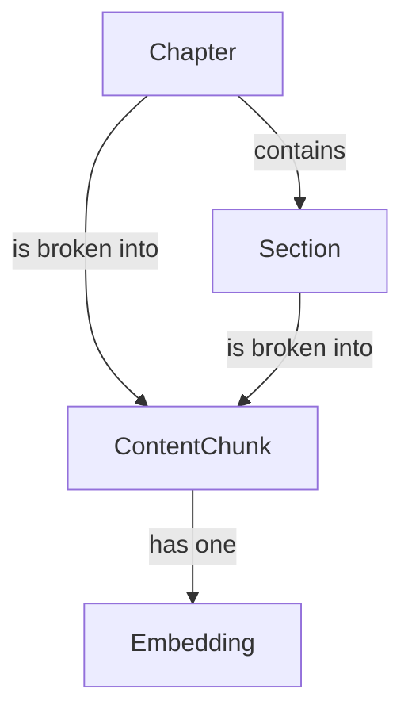

# Data Model

This document defines the key data entities for the book platform's content and RAG pipeline.

## 1. Core Content Entities

These entities represent the written content of the book.

### Chapter

Represents a single chapter in the book.

- **`title`**: `string` - The title of the chapter.
- **`slug`**: `string` - The URL-friendly identifier for the chapter.
- **`order`**: `integer` - The sequential order of the chapter in the book.
- **`content`**: `string` (MDX) - The full MDX content of the chapter.

### Section

A logical section within a chapter (optional).

- **`title`**: `string` - The title of the section (e.g., a H2 or H3 heading).
- **`chapter`**: `relationship` -> `Chapter` - The parent chapter.
- **`content`**: `string` (MDX) - The MDX content of this section.

## 2. RAG Pipeline Entities

These entities are used by the backend RAG service.

### ContentChunk

A small, discrete piece of text derived from a `Chapter` or `Section` for the purpose of embedding.

- **`id`**: `string` (UUID) - Unique identifier for the chunk.
- **`source`**: `string` - The origin of the chunk (e.g., file path or chapter/section slug).
- **`text`**: `string` - The raw text content of the chunk.
- **`embedding`**: `relationship` -> `Embedding` - The vector embedding for this chunk.

### Embedding

A vector representation of a `ContentChunk`.

- **`vector`**: `array<float>` - The high-dimensional vector.
- **`model`**: `string` - The name of the embedding model used to generate the vector.
- **`chunk`**: `relationship` -> `ContentChunk` - The content chunk this embedding represents.

## Relationships

